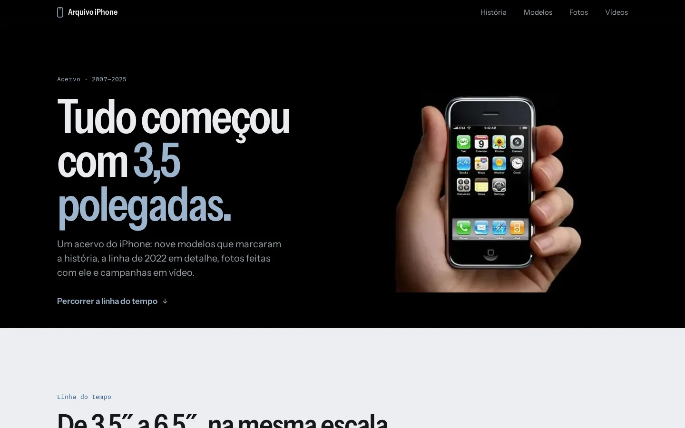
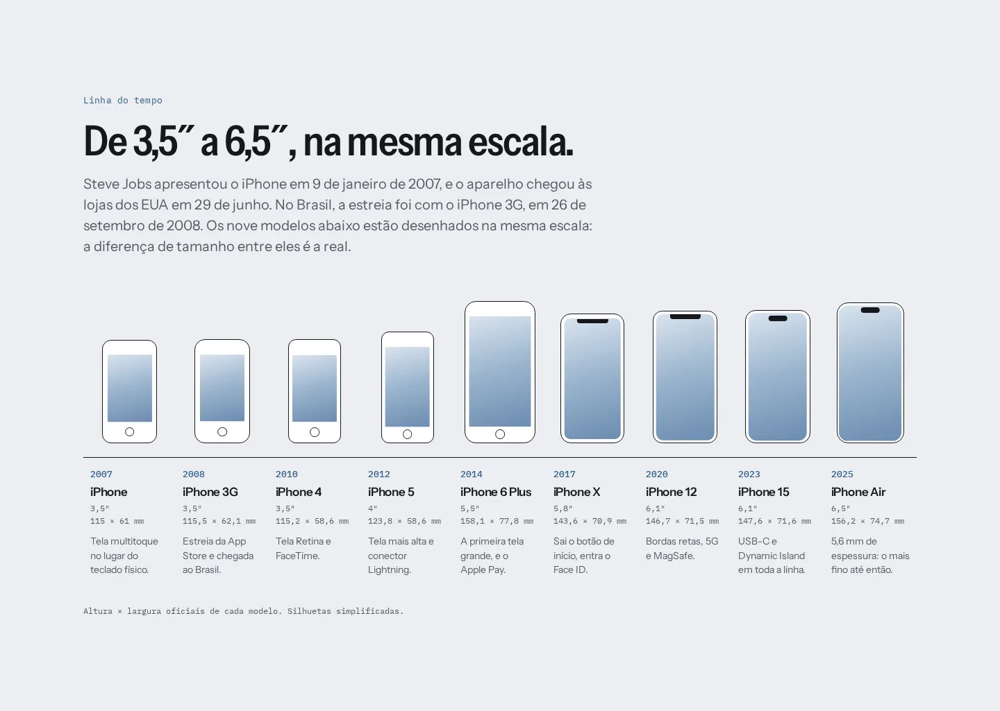
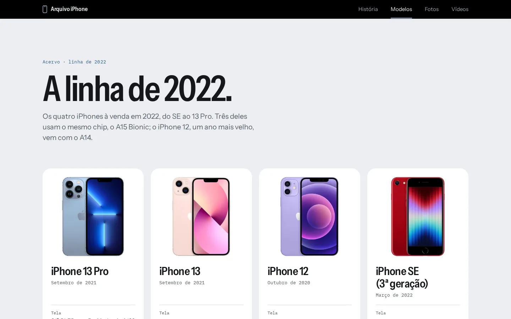
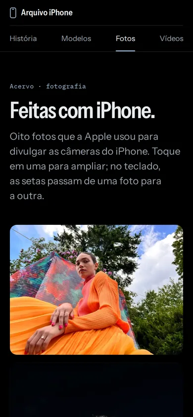

# Arquivo iPhone

[](https://github.com/TiagosailE/SITEIPHONE/actions/workflows/ci.yml)
[](https://github.com/TiagosailE/SITEIPHONE/actions/workflows/codeql.yml)

Um acervo do iPhone: a linha do tempo de 2007 a 2025 desenhada em escala real, a linha de 2022 em
detalhe, fotos feitas com iPhone e campanhas em vídeo.

**No ar:** https://tiagosaile.github.io/SITEIPHONE/



## De onde veio

Este foi o primeiro site que fiz, em 2023, acompanhando a aula da disciplina de Introdução à
Tecnologia Web (1º período de Sistemas de Informação da UniRios, em Paulo Afonso/BA) com o professor
Edemilton Junior. Em 2026 refiz tudo do zero, mantendo as quatro seções originais (início com a
história, modelos, fotos e vídeos), para ver até onde o mesmo site chega com o que aprendi desde então.

## A linha do tempo em escala

A peça central é a linha do tempo: nove modelos, do iPhone original ao iPhone Air, desenhados em CSS
a partir da altura e da largura oficiais de cada um, todos na mesma escala. A diferença de tamanho que
aparece na tela é a real. Um teste confere que o desenho e as medidas escritas no texto são as mesmas.



## Antes e depois

|                                 | 2023                                                                                    | 2026                                                              |
| ------------------------------- | --------------------------------------------------------------------------------------- | ----------------------------------------------------------------- |
| JavaScript                      | jQuery, bxSlider e Magnific Popup (127 KB) para um carrossel e um lightbox              | 10 KB de código próprio, sem nenhuma biblioteca                   |
| Imagens no repositório          | 4,6 MB, incluindo um GIF de 2,2 MB que nenhuma página usava                             | 1,4 MB em WebP, cada uma com largura e altura declaradas          |
| Pedidos a outros sites ao abrir | Google Fonts em todas as páginas e 4 players do YouTube na página de vídeos             | nenhum: fonte no próprio site, vídeo só carrega no clique         |
| Celular                         | menu, foto da história e grade de modelos estouravam a largura da tela                  | testado em 375 px, sem rolagem lateral                            |
| Acessibilidade                  | fotos sem texto alternativo, carrossel sem pausa                                        | nenhuma violação no axe (WCAG 2.2 AA), Lighthouse 100             |
| Vídeos                          | os 4 vídeos incorporados hoje estão privados no YouTube                                 | vídeos públicos da Apple Brasil, com fachada e link de volta      |
| Conteúdo                        | iPhone 12 com chip errado (A15), história copiada da Wikipédia, botões "Comprar" em `#` | A14 corrigido, texto próprio, ficha técnica no lugar de "Comprar" |
| Testes e CI                     | nenhum                                                                                  | 29 testes em desktop e celular, Lighthouse e CodeQL no CI         |

Notas do Lighthouse na versão nova (celular, com rede lenta simulada):

| Página  | Performance | Acessibilidade | Boas práticas | SEO |
| ------- | ----------- | -------------- | ------------- | --- |
| Início  | 98          | 100            | 100           | 100 |
| Modelos | 99          | 100            | 100           | 100 |
| Fotos   | 98          | 100            | 100           | 100 |
| Vídeos  | 98          | 100            | 100           | 100 |



## Como é feito

- **HTML, CSS e JavaScript puros, sem etapa de build.** O que está em `site/` é exatamente o que vai
  ao ar. O Node entra só como ferramenta de desenvolvimento.
- **CSS num arquivo só, em camadas** (`@layer reset, tokens, base, layout, components, pages,
utilities`), com a paleta e a escala tipográfica em variáveis. `subgrid` alinha as linhas da ficha
  técnica entre os cartões dos modelos.
- **JavaScript em módulos pequenos** (`carousel`, `lightbox`, `timeline`, `videos`), cada um ativado
  só se encontrar o próprio marcador na página. Sem JavaScript o site continua funcionando: a miniatura
  é um link para a foto grande e o vídeo é um link para o YouTube.
- **Carrossel sobre rolagem nativa** (`scroll-snap`): arrastar no celular funciona sem código. A
  rotação automática pausa com o mouse ou o foco em cima, tem botão de pausa e nem começa para quem
  pediu ao sistema para reduzir movimento.
- **Lightbox com `<dialog>` nativo**, que já cuida do foco, do Esc e de devolver o foco ao fechar.
- **Privacidade:** política de segurança (CSP) que só permite recursos do próprio site e o player do
  `youtube-nocookie.com`. Nenhum dado vai para terceiros até alguém clicar num vídeo.
- **Tipografia:** Instrument Sans para títulos e texto, IBM Plex Mono para as etiquetas e medidas, as
  duas hospedadas no próprio site.

As decisões e o que ficou de fora estão em [`docs/DECISIONS.md`](docs/DECISIONS.md).

<p align="center">
  
</p>

## Rodando localmente

Precisa do Node 22 (tem um `.nvmrc`).

```bash
npm install
npm start
```

O site abre em http://127.0.0.1:4173/SITEIPHONE/. O servidor local imita o GitHub Pages: o site fica
em `/SITEIPHONE/` e endereço inexistente devolve a página 404.

## Qualidade

`npm run ci` roda na máquina o mesmo conjunto que o GitHub Actions roda em cada PR:

| Comando                | O que confere                                                                            |
| ---------------------- | ---------------------------------------------------------------------------------------- |
| `npm run format:check` | formatação (Prettier)                                                                    |
| `npm run lint`         | JavaScript (ESLint), CSS (Stylelint) e HTML (html-validate com regras de acessibilidade) |
| `npm run links`        | todo link, imagem e âncora interna existe, sem depender da rede                          |
| `npm test`             | 29 testes no navegador (Playwright), em desktop e celular, com varredura do axe          |
| `npm run lighthouse`   | performance ≥ 90 e acessibilidade, boas práticas e SEO em 100, nas quatro páginas        |

Na primeira vez, `npx playwright install --with-deps chromium` baixa o navegador dos testes.

O deploy no GitHub Pages sai do mesmo workflow e só roda na `main`, depois que todos os jobs passam.
Só a pasta `site/` é publicada.

## Estrutura

```
site/                  o site publicado
  index.html           início: abertura, linha do tempo, campanhas
  pages/               modelos, fotos e vídeos
  404.html
  assets/css/main.css
  assets/js/           main.js + modules/
  assets/img/          imagens em WebP
  assets/fonts/        Instrument Sans e IBM Plex Mono (licença OFL)
tests/                 testes do Playwright
scripts/               servidor local e verificador de links
docs/                  decisões e imagens do README
```

## Créditos

Projeto de estudo, sem vínculo com a Apple Inc. iPhone é marca registrada da Apple Inc. Fotos,
banners e vídeos pertencem à Apple; a licença MIT deste repositório cobre só o código. As fontes são
distribuídas sob a SIL Open Font License (`site/assets/fonts/OFL.txt`).

Feito por [Tiago Santos](https://github.com/TiagosailE). Versão original de 2023 na disciplina do
professor Edemilton Junior ([@edemiltonjr](https://www.instagram.com/edemiltonjr)).
